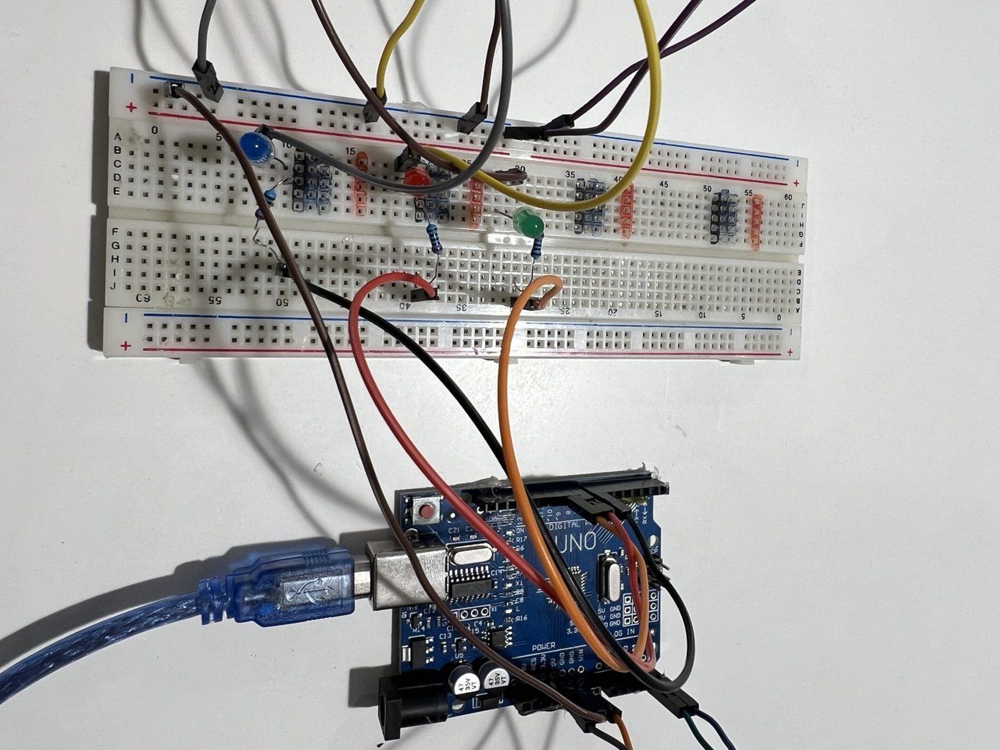

# HuskyLens Color Indicator Arduino

This project demonstrates a simple yet powerful implementation of Computer Vision using the HuskyLens AI camera and Arduino. The system identifies specific objects and provides real-time physical feedback by lighting up corresponding LEDs.

##  Overview
The project uses the I2C communication protocol to fetch data from the HuskyLens. When the camera identifies a learned object (assigned to ID 1, 2, or 3), the Arduino processes this data and triggers the specific LED circuit associated with that ID.

##  Project Demo
⁠

  

##  System Setup

##  Hardware Requirements
* Microcontroller: Arduino Uno
* Vision Sensor: DFRobot HuskyLens
* Indicators: 3x LEDs (Blue, Red, Green)
* Components: 3x 220Ω Resistors, Breadboard, Jumper Wires

##  How It Works
1.  Training: Train the HuskyLens to recognize your target objects and assign them to ID 1, 2, and 3.
2.  Communication: The Arduino communicates with the HuskyLens via the I2C protocol.
3.  Processing: The system reads the result.ID and switches the corresponding digital pin to HIGH while keeping others LOW.

